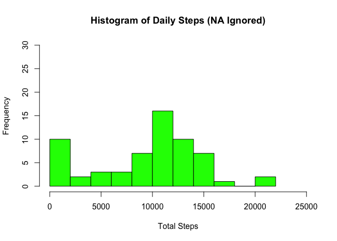
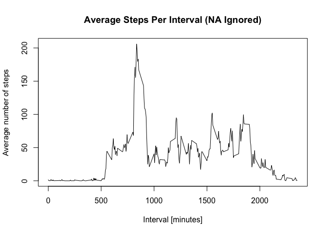
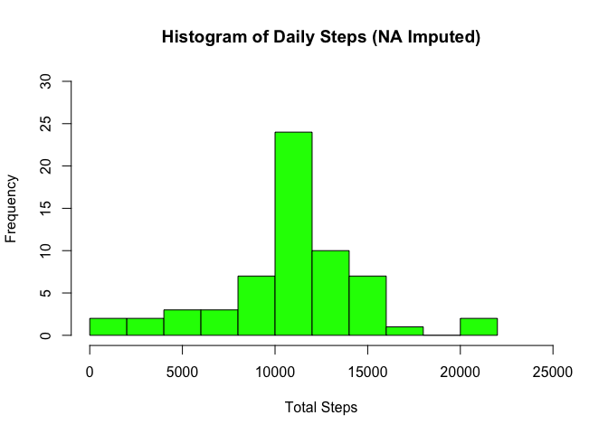
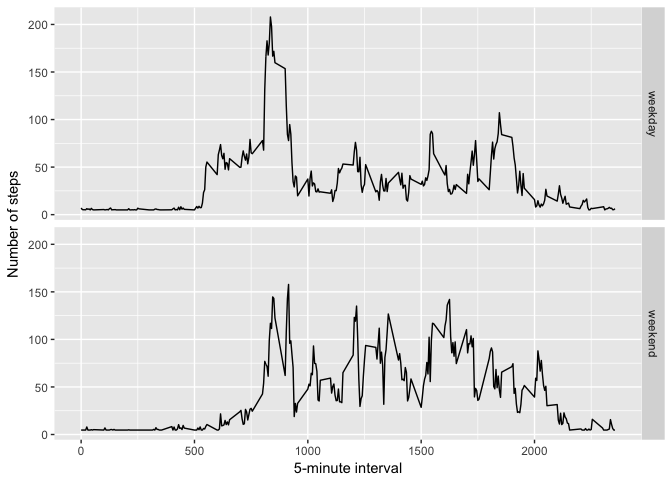

# Reproducible Research: Peer Assessment 1


## Loading and preprocessing the data
##### 1. Load the data (i.e. read.csv())

```r
if(!file.exists('activity.csv')){
    unzip('activity.zip')
}
activity <- read.csv("activity.csv")
```

##### 2. Process/transform the data (if necessary) into a format suitable for your analysis

```r
activity$date <- as.Date(activity$date)
activity$day <- ifelse(weekdays(activity$date) == "Saturday" | weekdays(activity$date) == "Sunday" ,"weekend","weekday")
```

-----

## What is mean total number of steps taken per day?

```r
dailysteps <- tapply(activity$steps, activity$date, sum, na.rm=TRUE)
```

##### 1. Make a histogram of the total number of steps taken each day.

```r
hist(dailysteps, breaks=15, ylim=c(0, 30), xlim = c(0, 25000), xlab="Total Steps", ylab="Frequency", main="Histogram of Daily Steps (NA Ignored)", col="green")
```

<!-- -->

##### 2. Calculate and report the mean and median total number of steps taken per day.

```r
mean_dailysteps <- mean(dailysteps) 
median_dailysteps <- median(dailysteps)
```
* Mean: 9354.2295082
* Median: 10395

-----

## What is the average daily activity pattern?

```r
averages <- aggregate(x=list(steps=activity$steps), by=list(interval=activity$interval), FUN=mean, na.rm=TRUE)
```

##### 1. Make a time series plot

```r
plot(averages$interval, averages$steps, type="l", xlab="Interval [minutes]", ylab="Average number of steps", main="Average Steps Per Interval (NA Ignored)")
```

<!-- -->

##### 2. Which 5-minute interval, on average across all the days in the dataset, contains the maximum number of steps?

```r
most.steps <- averages$interval[averages$steps == max(averages$steps)]
```
* Which 5-minute interval, on average across all the days in the dataset, contains the maximum number of steps?: 835

-----

## Imputing missing values
##### 1. Calculate and report the total number of missing values in the dataset 

```r
numMissingValues <- length(which(is.na(activity$steps)))
```
* Number of missing values: 2304

##### 2. Devise a strategy for filling in all of the missing values in the dataset.
##### 3. Create a new dataset that is equal to the original dataset but with the missing data filled in.

```r
filled.activity <- activity
na_pos <- which(is.na(activity$steps))
mean_vec <- rep(mean(activity$steps, na.rm=TRUE), times=length(na_pos))
filled.activity[na_pos, "steps"] <- mean_vec
```

##### 4. Make a histogram of the total number of steps taken each day...

```r
dailysteps <- tapply(filled.activity$steps, filled.activity$date, sum, na.rm=TRUE)
hist(dailysteps, breaks=15, ylim=c(0, 30), xlim = c(0, 25000), xlab="Total Steps", ylab="Frequency", main="Histogram of Daily Steps (NA Imputed)", col="green")
```

<!-- -->

##### ... and calculate and report the mean and median total number of steps taken per day.

```r
mean_dailysteps <- mean(dailysteps)
median_dailysteps <- median(dailysteps)
```
* Mean: 1.0766189\times 10^{4}
* Median: 1.0766189\times 10^{4}

-----

## Are there differences in activity patterns between weekdays and weekends?
##### 1. Create a new factor variable in the dataset with two levels – “weekday” and “weekend” indicating whether a given date is a weekday or weekend day.

```r
averages <- aggregate(steps ~ interval + day, data=filled.activity, mean)
```

##### 2. Make a panel plot containing a time series plot

```r
ggplot(averages, aes(interval, steps)) + geom_line() + facet_grid(day ~ .) + xlab("5-minute interval") + ylab("Number of steps")
```

<!-- -->
